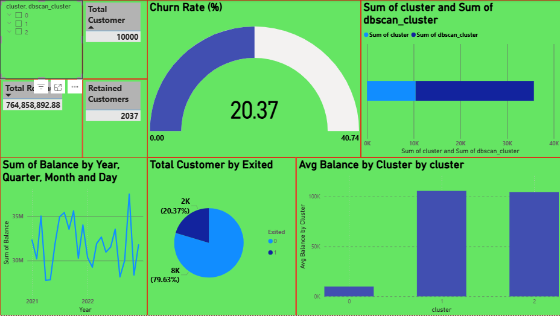

# 📉 Customer Churn Prediction

This project aims to analyze customer behavior and predict churn using machine learning models and business intelligence tools. It includes both a Jupyter Notebook for data science and a Power BI dashboard for stakeholder-friendly visualization.

---

## 📁 Project Contents

- `Customer_Churn_Prediction.ipynb` – Exploratory data analysis, preprocessing, model building (Logistic Regression, Random Forest, etc.), evaluation.
- `churn_data.csv` – Dataset used for training and analysis.
- `Customer_Churn.pbix` – Power BI dashboard with insights such as:
  - Customer demographics
  - Churn distribution
  - Monthly churn trends
  - Key churn drivers
- `requirements.txt` – Required Python packages to run the notebook.


## 📸 Power BI Dashboard Preview



---

##📊 Tools & Technologies:

Python (pandas, scikit-learn, xgboost)

Jupyter Notebook

Power BI Desktop

Machine Learning: Classification, Feature Importance, Model Evaluation

---
##💡 Goals:

Identify key factors influencing customer churn

Build a reliable predictive model to classify churned customers

Visualize insights through an executive-friendly Power BI dashboard

## 💻 How to Run

### 1. Run the Jupyter Notebook
```bash
pip install -r requirements.txt
jupyter notebook Customer_Churn_Prediction.ipynb
